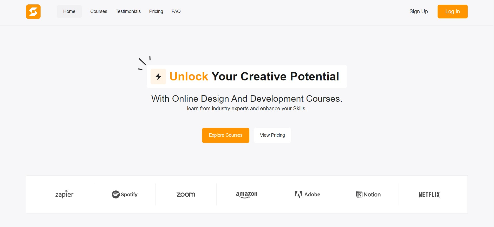

# Skill Bridge - Your Gateway to Learning

## Overview
Skill Bridge is committed to delivering a clean, structured, and intuitive learning experience. Our platform is designed to be user-friendly, offering a seamless journey for learners to acquire knowledge and skills.

## Features

- **User-Friendly Interface:** Skillbridge platform ensures a smooth and straightforward user experience,with a smooth User Interface.
- **Responsive Platform:** Access Skill Bridge on any device - desktop, tablet, or smartphone - with a consistent and enjoyable learning experience.

## Design Attribution

The design for Skill Bridge was crafted using a free Figma template from [FreeFigmaTemplates.com](https://freefigmatemplates.com). i express my gratitude for the valuable design resources they provide.

## Technologies Used

- Html
- Css

## Visit the Website

To see live Demo: [Skill Bridge](https://abumulla-mohammad.github.io/Skillbridge/)
